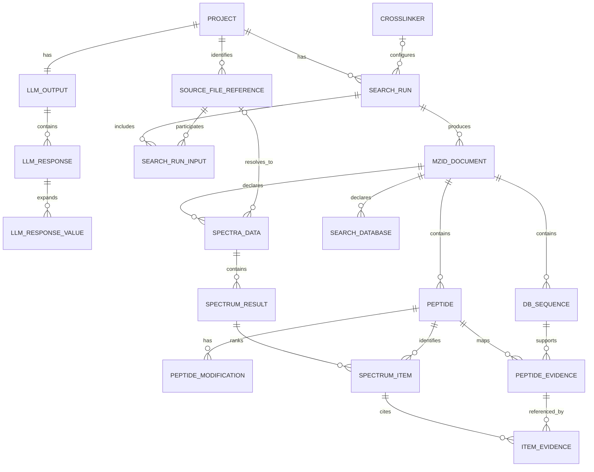

# xHAMLET Result Database Schema

**Status:** Proposed design
**Database system:** PostgreSQL 16 or newer
**Inputs:** `llm/responses.json` and ReLink `results.mzid`

## 1. Scope

This database stores xHAMLET result information only.

It stores:

- all content parsed from each PXD's `llm/responses.json`;
- all scientific and provenance information parsed from each `results.mzid`;
- source RAW filenames as identifiers that connect mzIdentML results to experiments;
- crosslinker, organism, model, and software-version provenance; and
- one accepted, successfully validated result set for each PXD.

It does **not** store:

- RAW file content;
- mzML file content;
- FASTA file content;
- Nextflow work directories;
- Xi intermediate CSV files; or
- other pipeline caches and temporary files.

A source RAW filename is retained only as a short text identifier. The `.raw` binary is
never uploaded to or managed by PostgreSQL.

The original JSON and mzIdentML files may be retained separately for backup or audit, but
external artifact storage is outside this database schema.

## 2. What Kind of Database Is This?

The database will use **PostgreSQL 16 or newer**. PostgreSQL is a relational database
management system. It stores information in related tables and is queried using SQL
(Structured Query Language). SQL is the language used to ask questions of the data;
PostgreSQL is the software that stores and manages it.

PostgreSQL is appropriate here because it:

- reliably maintains relationships between projects, files, searches, and results;
- supports transactions, which prevent partially imported results from appearing as
   complete;
- supports `JSONB`, allowing the complete LLM JSON to be retained and queried;
- provides indexes for efficient searches across large result collections; and
- supports table partitioning and bulk loading if the mzIdentML result tables become
   very large.

### How to Read This Schema

A **table** is similar to a spreadsheet devoted to one type of information. For example,
the `project` table contains projects, while the `peptide` table contains peptides.

A **source document** is one input file whose information is imported into the database.
In this design, one `responses.json` file is an LLM source document and one
`results.mzid` file is an mzIdentML source document. A source document is not a
PostgreSQL table:

- The source document is the original JSON or XML structure produced by xHAMLET.
- A table is a database structure that combines the same kind of records from many
   source documents, projects, and runs.
- The `mzid_document` table has one row for each imported `results.mzid` source
   document. Its related peptide and spectrum rows are placed in the other mzIdentML
   tables.
- The `llm_output` table has one row for each imported `responses.json` source document.
   The complete JSON is kept in that row, and searchable fields are placed in related
   LLM tables.

For example, importing 100 `results.mzid` files does not create 100 PostgreSQL tables.
It creates 100 rows in `mzid_document`, while all peptides from those files go into the
shared `peptide` table. Their `mzid_document_id` values keep the records separated.

- A **row** is one record, such as one project or one peptide.
- A **column** is one property of that record, such as an accession or sequence.
- A **primary key** is the database's unique identifier for a row.
- A **foreign key (FK)** stores the primary key of a related row in another table.
- A **unique constraint** prevents duplicate values where duplicates would be invalid.
- **Nullable** means a value may be absent.
- An **index** is an additional lookup structure that makes common searches faster.
- A **view** is a saved SQL query that presents existing rows in a useful form.

Frequently used PostgreSQL data types in this document are:

| Type | Plain-language meaning |
|---|---|
| `TEXT` | Text of any practical length |
| `INTEGER` / `BIGINT` | Whole numbers; `BIGINT` supports much larger values |
| `DOUBLE PRECISION` | A decimal measurement or score |
| `BOOLEAN` | `true` or `false` |
| `TIMESTAMPTZ` | A date and time with time-zone handling |
| `UUID` | A globally unique identifier generated by the application or database |
| `JSONB` | Structured JSON stored in a searchable PostgreSQL format |
| `CHAR(64)` | Fixed-length text used here for a SHA-256 checksum |

The schema is **normalized**, meaning repeated information is separated into related
tables instead of being copied into every result row. For example, a project is stored
once and its LLM, search, peptide, and spectrum rows refer to it through related IDs.

The LLM `parsed.value` and `parsed.accession` fields may contain text, arrays, or null.
A project may have multiple mzIdentML documents when it contains multiple source files
or crosslinker chemistries. PostgreSQL supports both cases without changing the table
structure.

## 3. Result Relationships

The database is divided into four layers:

1. **Project and source tables** identify the PXD and its source RAW filenames.
2. **LLM tables** retain the complete JSON and split its fields into rows that are easy
   to search.
3. **Search context tables** record which source filename, organism, and crosslinker
   belong together.
4. **mzIdentML tables** split each XML source document into spectra, identifications, peptides,
   modifications, and proteins while preserving their links.

There are several tables because molecular identity and experimental observations are
different kinds of information. A peptide row describes what was identified: its
sequence and modifications. A spectrum-item row describes one observation of that
peptide in one mzIdentML source document: its score, charge, threshold status, intensity or
abundance when supplied, and other result-specific values.

The same sequence may therefore appear in several places without its measurements being
combined:

- The same sequence in another mzIdentML document receives a different `peptide_id`.
- Documents from different projects never share peptide rows.
- Within one document, several `spectrum_item` rows may refer to the same `peptide_id`.
   Each spectrum item retains its own measurements.
- The same sequence with different modifications is represented by distinct peptide rows
   or distinct document-local peptide definitions, following the source mzIdentML.

For example, peptide `PEPTIDEK` observed in project A with intensity 100 and in project B
with intensity 450 produces separate spectrum-item measurements. The sequence text can
be compared in a query, but PostgreSQL does not replace either measurement or treat 100
and 450 as properties of the sequence itself.

Most table names have a matching column ending in `_id`. This value is an internal label
used to connect rows. Users normally search by meaningful fields such as PXD accession,
source filename, peptide sequence, protein accession, or crosslinker name rather than by
these internal IDs.

Only successful, validated xHAMLET results are stored. The database does not create rows
for attempted or failed xHAMLET pipeline executions.

The general hierarchy is:

```text
PXD project
├── LLM output: one accepted responses.json result
└── search run: one organism/crosslinker ReLink result group
      ├── source file reference(s): RAW filenames only
      └── mzIdentML source document(s): imported results.mzid files
```
- A **search run** groups the accepted ReLink results for one organism and crosslinker
   combination within a PXD. It can include one or more source RAW filenames and produce
   one or more mzIdentML source documents. It does not represent an unsuccessful attempt.
- A **source file reference** is only the filename of one RAW input. The database does
   not store the RAW file itself.
- An **mzIdentML source document** is one imported `results.mzid` file produced by a
   search run.

### How the SQL database tables are connected


The lines in the diagram connect related tables. A branching end means that one row can
relate to many rows in the other table. In plain language, the expected relationships
are:

- One PXD has one accepted LLM output.
- A PXD has one source-file reference per distinct RAW filename.
- One source-file reference can participate in multiple chemistry-specific searches.
- One search run represents one organism and crosslinker combination.
- One search run produces one or more mzIdentML documents.
- Each searched source RAW filename must resolve to at least one imported mzIdentML
   document.

The last rule is checked before the PXD result set is committed to permanent tables.
Failed or incomplete imports are rolled back and leave no stored result rows.

## 4. Project and Source Tables

### `project`

This is the top-level table. Each row identifies one PRIDE project.

| Column | Type | Meaning |
|---|---|---|
| `project_id` | `BIGINT GENERATED ALWAYS AS IDENTITY` | Primary key |
| `accession` | `TEXT` | Unique PXD accession; check `^PXD[0-9]+$` |
| `xhamlet_commit` | `TEXT` | Nullable full Git SHA that produced the accepted results |
| `imported_at` | `TIMESTAMPTZ` | Time the accepted result set was stored |
| `created_at` | `TIMESTAMPTZ` | Default `now()` |
| `updated_at` | `TIMESTAMPTZ` | Last catalog update |

If a PXD is successfully reprocessed, its accepted dependent result rows are replaced
inside one transaction and these provenance fields are updated. Failed processing does
not alter this row or its existing accepted results.

### `source_file_reference`

This table identifies an experimental RAW file without storing it.

| Column | Type | Meaning |
|---|---|---|
| `source_file_id` | `UUID` | Primary key |
| `project_id` | `BIGINT` | FK to `project` |
| `filename` | `TEXT` | Original RAW filename only |
| `created_at` | `TIMESTAMPTZ` | Default `now()` |

Unique constraint: `(project_id, filename)`.

There is deliberately no binary-content, filesystem-path, URL, checksum, or RAW-file
size column. If later required, external identifiers can be added without storing the
file itself.

## 5. LLM Result Tables

### `llm_output`

One complete, accepted `responses.json` result per PXD.

| Column | Type | Meaning |
|---|---|---|
| `llm_output_id` | `UUID` | Primary key |
| `project_id` | `BIGINT` | Unique FK to `project` |
| `saved_at` | `TIMESTAMPTZ` | JSON metadata timestamp |
| `model_default` | `TEXT` | Common model, when applicable |
| `entry_count` | `INTEGER` | Number of response keys |
| `source_json` | `JSONB` | Complete original `responses.json` document |
| `source_sha256` | `CHAR(64)` | Checksum used to detect changes and duplicate imports |

The full JSON is small enough to retain in PostgreSQL. `source_json` is the lossless
record; the child tables are query projections.

### `llm_response`

One row per key such as `comment[cross-linker]`.

| Column | Type | Meaning |
|---|---|---|
| `llm_response_id` | `BIGINT GENERATED ALWAYS AS IDENTITY` | Primary key |
| `llm_output_id` | `UUID` | FK to `llm_output` |
| `field_key` | `TEXT` | Original response key |
| `prompt_group` | `TEXT` | Prompt family |
| `model` | `TEXT` | Model used for this response |
| `raw_response_text` | `TEXT` | Exact model response string |
| `parsed_json` | `JSONB` | Complete parsed response object |
| `value_json` | `JSONB` | Exact string, array, or null value |
| `accession_json` | `JSONB` | Exact string, array, or null accession |
| `confidence` | `TEXT` | Usually `high`, `medium`, or `low` |
| `evidence_quote` | `TEXT` | Nullable |
| `evidence_location` | `TEXT` | Nullable |
| `evidence_location_note` | `TEXT` | Nullable |

Unique constraint: `(llm_output_id, field_key)`.

Keeping both `raw_response_text` and `parsed_json` supports audits and parser regression
analysis. Special keys such as `NT`, `AC`, `CL`, and `TA` remain in `parsed_json`.

### `llm_response_value`

Query-friendly expansion for scalar and array values.

| Column | Type | Meaning |
|---|---|---|
| `llm_response_id` | `BIGINT` | FK to `llm_response` |
| `ordinal` | `INTEGER` | Zero-based array position; zero for a scalar |
| `value_text` | `TEXT` | Nullable normalized display value |
| `accession` | `TEXT` | Nullable aligned accession |

Primary key: `(llm_response_id, ordinal)`.

## 6. Search Context Tables

### `crosslinker`

| Column | Type | Meaning |
|---|---|---|
| `crosslinker_id` | `BIGINT GENERATED ALWAYS AS IDENTITY` | Primary key |
| `name` | `TEXT` | Canonical unique name |
| `xlmod_accession` | `TEXT` | Nullable indexed accession |

### `search_run`

Groups the accepted ReLink results for one PXD, organism, and crosslinker. Only completed
and validated search results are inserted.

| Column | Type | Meaning |
|---|---|---|
| `search_run_id` | `UUID` | Primary key |
| `project_id` | `BIGINT` | FK to `project` |
| `taxid` | `TEXT` | Nullable NCBI taxonomy ID without prefix |
| `crosslinker_id` | `BIGINT` | Nullable FK for unresolved/dataset fallback |
| `run_label` | `TEXT` | Stable label such as `dsso` |
| `relink_commit` | `TEXT` | Nullable full ReLink Git SHA |
| `metadata_json` | `JSONB` | Search provenance found in results |

Use `UNIQUE NULLS NOT DISTINCT (project_id, taxid, crosslinker_id, run_label)`.

### `search_run_input`

Records which RAW filename identifiers belong to a search. It does not store files.

| Column | Type | Meaning |
|---|---|---|
| `search_run_id` | `UUID` | FK to `search_run` |
| `source_file_id` | `UUID` | FK to `source_file_reference` |
| `assignment_source` | `TEXT` | `file_cluster`, `dataset_fallback`, or `mzid` |
| `cluster_id` | `TEXT` | Nullable LLM cluster identifier |

Primary key: `(search_run_id, source_file_id)`.

## 7. mzIdentML Source Document Tables

Each row in `mzid_document` represents one imported `results.mzid` source document. It
does not create a separate table for that file. mzIdentML XML IDs are unique only within
one source document, so every imported entity belongs to a `mzid_document_id`.

The database stores normalized mzIdentML information, not the XML file itself.
`source_sha256` and optional source filename identify the imported document.

### `mzid_document`

| Column | Type | Meaning |
|---|---|---|
| `mzid_document_id` | `UUID` | Primary key |
| `search_run_id` | `UUID` | FK to `search_run` |
| `source_filename` | `TEXT` | Original mzIdentML filename |
| `source_sha256` | `CHAR(64)` | Checksum used to detect changes and duplicate imports |
| `xml_id` | `TEXT` | Root `MzIdentML.id` |
| `version` | `TEXT` | For example `1.3.0` |
| `namespace_uri` | `TEXT` | XML namespace |
| `creation_time` | `TIMESTAMPTZ` | Nullable XML creation time |
| `document_metadata` | `JSONB` | Complete header/protocol/software metadata |
| `spectrum_result_count` | `BIGINT` | Validation count |
| `spectrum_item_count` | `BIGINT` | Validation count |
| `passing_item_count` | `BIGINT` | Validation count |

Unique constraint: `(search_run_id, source_sha256)`.

Only complete documents with at least one spectrum result and identification item are
inserted. Parsing errors are reported by the import process but are not stored as result
rows.

### `spectra_data`

Represents the mzIdentML `SpectraData` element and links it to a RAW filename identifier.
It does not store RAW or mzML content.

| Column | Type | Meaning |
|---|---|---|
| `spectra_data_id` | `BIGINT GENERATED ALWAYS AS IDENTITY` | Primary key |
| `mzid_document_id` | `UUID` | FK to `mzid_document` |
| `xml_id` | `TEXT` | Document-local ID |
| `location` | `TEXT` | Original mzIdentML spectra location text |
| `source_file_id` | `UUID` | Nullable FK to `source_file_reference` |
| `resolution_status` | `TEXT` | `resolved`, `unresolved_no_match`, or `unresolved_ambiguous` |
| `resolution_diagnostic` | `TEXT` | Nullable diagnostic |
| `file_format_accession` | `TEXT` | Nullable CV accession |
| `spectrum_id_format_accession` | `TEXT` | Nullable CV accession |

Unique constraint: `(mzid_document_id, xml_id)`.

### `search_database`

Stores only database declarations contained in mzIdentML, not FASTA content.

| Column | Type | Meaning |
|---|---|---|
| `search_database_id` | `BIGINT GENERATED ALWAYS AS IDENTITY` | Primary key |
| `mzid_document_id` | `UUID` | FK to `mzid_document` |
| `xml_id` | `TEXT` | Document-local ID |
| `location` | `TEXT` | Original declaration text |
| `name` | `TEXT` | Nullable database name |
| `version` | `TEXT` | Nullable database version |
| `sequence_count` | `BIGINT` | Nullable |
| `file_format_accession` | `TEXT` | Nullable CV accession |

Unique constraint: `(mzid_document_id, xml_id)`.

### `db_sequence`

| Column | Type | Meaning |
|---|---|---|
| `db_sequence_id` | `BIGINT GENERATED ALWAYS AS IDENTITY` | Primary key |
| `mzid_document_id` | `UUID` | FK to `mzid_document` |
| `xml_id` | `TEXT` | Document-local ID |
| `search_database_id` | `BIGINT` | FK to `search_database` |
| `accession` | `TEXT` | Protein accession |
| `name` | `TEXT` | Nullable protein name |
| `length` | `INTEGER` | Nullable |
| `sequence` | `TEXT` | Nullable sequence embedded in mzIdentML |
| `description` | `TEXT` | Nullable protein description |

Unique constraint: `(mzid_document_id, xml_id)`.

### `peptide`

| Column | Type | Meaning |
|---|---|---|
| `peptide_id` | `BIGINT GENERATED ALWAYS AS IDENTITY` | Primary key |
| `mzid_document_id` | `UUID` | FK to `mzid_document` |
| `xml_id` | `TEXT` | Document-local ID |
| `sequence` | `TEXT` | Peptide sequence |

Unique constraint: `(mzid_document_id, xml_id)`.

Peptides are kept separate between mzIdentML documents even when their sequences match.
A precomputed summary table, called a materialized view in PostgreSQL, can later group
equivalent sequence and modification combinations for analysis.

The `peptide` and `peptide_modification` tables contain identification only. They must
not contain intensity, abundance, score, charge, retention time, or other
observation-specific values. This rule prevents one run's measurement from being reused
for another run merely because the peptide sequence is the same.

### `peptide_modification`

| Column | Type | Meaning |
|---|---|---|
| `modification_id` | `BIGINT GENERATED ALWAYS AS IDENTITY` | Primary key |
| `peptide_id` | `BIGINT` | FK to `peptide` |
| `ordinal` | `INTEGER` | XML order |
| `location` | `INTEGER` | Nullable residue position |
| `residues` | `TEXT` | Nullable residue code(s) |
| `monoisotopic_mass_delta` | `DOUBLE PRECISION` | Nullable |
| `average_mass_delta` | `DOUBLE PRECISION` | Nullable |

Unique constraint: `(peptide_id, ordinal)`.

### `peptide_evidence`

| Column | Type | Meaning |
|---|---|---|
| `peptide_evidence_id` | `BIGINT GENERATED ALWAYS AS IDENTITY` | Primary key |
| `mzid_document_id` | `UUID` | FK to `mzid_document` |
| `xml_id` | `TEXT` | Document-local ID |
| `peptide_id` | `BIGINT` | FK to `peptide` |
| `db_sequence_id` | `BIGINT` | FK to `db_sequence` |
| `start_position` | `INTEGER` | Nullable |
| `end_position` | `INTEGER` | Nullable |
| `pre_residue` | `TEXT` | Nullable |
| `post_residue` | `TEXT` | Nullable |
| `is_decoy` | `BOOLEAN` | Nullable when not supplied |

### `spectrum_result`

This row represents one measured spectrum in one mzIdentML document. Values describing
the spectrum as a whole, such as scan-level intensity or retention time when present,
are attached here through `mzid_cv_param` or `mzid_user_param`.

| Column | Type | Meaning |
|---|---|---|
| `spectrum_result_id` | `BIGINT GENERATED ALWAYS AS IDENTITY` | Primary key |
| `mzid_document_id` | `UUID` | FK to `mzid_document` |
| `spectra_data_id` | `BIGINT` | FK to `spectra_data` |
| `xml_id` | `TEXT` | Document-local ID |
| `spectrum_native_id` | `TEXT` | Original `spectrumID` |
| `scan_number` | `BIGINT` | Nullable parsed convenience value |

Unique constraint: `(mzid_document_id, xml_id)`.

### `spectrum_item`

One ranked PSM or cross-link spectrum-identification item. This is the observation-level
row: values specific to one peptide identification in one spectrum and one accepted PXD result
belong here, not on the peptide row.

| Column | Type | Meaning |
|---|---|---|
| `spectrum_item_id` | `BIGINT GENERATED ALWAYS AS IDENTITY` | Primary key |
| `mzid_document_id` | `UUID` | Document scope and partition key |
| `spectrum_result_id` | `BIGINT` | FK to `spectrum_result` |
| `peptide_id` | `BIGINT` | FK to `peptide` |
| `xml_id` | `TEXT` | Document-local ID |
| `rank` | `INTEGER` | Identification rank |
| `pass_threshold` | `BOOLEAN` | Threshold result |
| `charge_state` | `INTEGER` | Nullable |
| `experimental_mz` | `DOUBLE PRECISION` | Nullable |
| `calculated_mz` | `DOUBLE PRECISION` | Nullable |
| `calculated_pi` | `DOUBLE PRECISION` | Nullable |
| `xi_score` | `DOUBLE PRECISION` | Nullable query convenience value |
| `crosslink_group_key` | `TEXT` | Nullable query convenience value |

Unique constraint: `(mzid_document_id, xml_id)`.

Common values such as xi score have convenience columns for faster queries. Other
measurements, including intensity or abundance when present in mzIdentML, are stored in
`mzid_cv_param` or `mzid_user_param` with this `spectrum_item` as their owner. This keeps
the original accession, name, value, and unit instead of assuming every mzIdentML
producer uses the same measurement vocabulary.

### `item_evidence`

| Column | Type | Meaning |
|---|---|---|
| `spectrum_item_id` | `BIGINT` | FK to `spectrum_item` |
| `peptide_evidence_id` | `BIGINT` | FK to `peptide_evidence` |

Primary key: `(spectrum_item_id, peptide_evidence_id)`.

A spectrum item can reference multiple peptide-evidence rows.

## 8. mzIdentML Parameters

mzIdentML is extensible, so scores, intensities, abundances, retention times, and other
annotations must not require a new physical column for every CV term. Each parameter row
uses `owner_type` and `owner_id` to attach the value to the exact document-local entity
where it appeared. For example:

- a peptide-identification intensity can have owner type `spectrum_item`;
- a scan-level measurement can have owner type `spectrum_result`; and
- a protein annotation can have owner type `db_sequence`.

Because those owner rows belong to a specific mzIdentML document, and that document
belongs to a specific project and search, measurements cannot leak across projects or
search results.

### `mzid_cv_param`

| Column | Type | Meaning |
|---|---|---|
| `cv_param_id` | `BIGINT GENERATED ALWAYS AS IDENTITY` | Primary key |
| `mzid_document_id` | `UUID` | FK to `mzid_document` |
| `owner_type` | `TEXT` | Entity type owning the parameter |
| `owner_id` | `BIGINT` | Internal row ID in that entity table |
| `ordinal` | `INTEGER` | XML order within the owner |
| `cv_ref` | `TEXT` | For example `PSI-MS` or `UNIMOD` |
| `accession` | `TEXT` | CV accession |
| `name` | `TEXT` | Original name |
| `value_text` | `TEXT` | Nullable original value |
| `unit_cv_ref` | `TEXT` | Nullable |
| `unit_accession` | `TEXT` | Nullable |
| `unit_name` | `TEXT` | Nullable |

### `mzid_user_param`

| Column | Type | Meaning |
|---|---|---|
| `user_param_id` | `BIGINT GENERATED ALWAYS AS IDENTITY` | Primary key |
| `mzid_document_id` | `UUID` | FK to `mzid_document` |
| `owner_type` | `TEXT` | Entity type owning the parameter |
| `owner_id` | `BIGINT` | Internal row ID in that entity table |
| `ordinal` | `INTEGER` | XML order within the owner |
| `name` | `TEXT` | Original name |
| `value_text` | `TEXT` | Nullable original value |
| `type_name` | `TEXT` | Nullable mzIdentML value type |
| `unit_cv_ref` | `TEXT` | Nullable |
| `unit_accession` | `TEXT` | Nullable |
| `unit_name` | `TEXT` | Nullable |

Any parameter whose owner cannot be resolved causes document ingestion to fail. It is
never silently discarded.

## 9. Protein Detection Tables

To retain the mzIdentML protein-inference graph:

- `protein_ambiguity_group` stores document-local groups;
- `protein_detection_hypothesis` links groups to database sequences;
- `peptide_hypothesis` links protein hypotheses to peptide evidence; and
- `peptide_hypothesis_item` links peptide hypotheses to spectrum items.

CV and user parameters attach through the generic parameter tables. These tables may be
empty when a mzIdentML document has no protein-detection results.

## 10. Import Rules

A PXD's accepted results are inserted or replaced only when:

1. Exactly one complete `llm_output` is available.
2. Every LLM source key has one `llm_response` row.
3. Every `search_run_input` source filename resolves through at least one `spectra_data`
   row in an imported mzIdentML document.
4. Every mzIdentML internal reference resolves within the same document.
5. Parsed entity counts match the document count columns.
6. Parsing reaches the closing `MzIdentML` element.
7. Every CV and user parameter has a valid owner.
8. Stored source checksums match the imported JSON and mzIdentML inputs.

Recommended coverage view:

```sql
CREATE VIEW missing_mzid_for_search_input AS
SELECT sri.search_run_id, sri.source_file_id
FROM search_run_input sri
JOIN search_run sr USING (search_run_id)
LEFT JOIN mzid_document md
  ON md.search_run_id = sr.search_run_id
LEFT JOIN spectra_data sd
  ON sd.mzid_document_id = md.mzid_document_id
 AND sd.source_file_id = sri.source_file_id
GROUP BY sri.search_run_id, sri.source_file_id
HAVING count(sd.spectra_data_id) = 0;
```

This permits several mzIdentML outputs for the same source filename and different
crosslinkers while reporting missing expected results.

## 11. Indexing and Scale

Indexes are lookup structures maintained by PostgreSQL. They use additional disk space
but make common searches much faster. The following minimum indexes are recommended;
this list is primarily for the database implementer:

```text
project(accession) UNIQUE
source_file_reference(project_id, filename) UNIQUE
llm_output(project_id) UNIQUE
llm_response(llm_output_id, field_key) UNIQUE
llm_response(prompt_group, field_key)
llm_response USING GIN(parsed_json)
search_run(project_id, taxid, crosslinker_id)
search_run_input(source_file_id, search_run_id)
mzid_document(search_run_id)
spectra_data(source_file_id)
db_sequence(mzid_document_id, accession)
peptide(mzid_document_id, sequence)
spectrum_result(spectra_data_id, spectrum_native_id)
spectrum_item(mzid_document_id, pass_threshold)
spectrum_item(spectrum_result_id, rank)
spectrum_item(mzid_document_id, xi_score)
mzid_cv_param(owner_type, owner_id, accession)
```

Start with ordinary PostgreSQL tables. Benchmark at least 20 representative PXDs before
partitioning. Partitioning means dividing one very large logical table into smaller
physical pieces that PostgreSQL still presents as one table. If `spectrum_item` volume
is projected above roughly 100 million rows, partition the large mzIdentML tables by
project hash or ingestion batch.

For billion-row analysis, PostgreSQL remains authoritative and selected result tables can
be exported to Parquet for DuckDB, Trino, or a warehouse. These exports contain result
rows, not RAW or mzML data.

## 12. Ingestion Workflow

1. Parse `responses.json` and all expected mzIdentML files into temporary staging data.
2. Validate JSON completeness, XML completion, internal references, parameters, entity
   counts, and source filename coverage.
3. If validation fails, report the error and discard the temporary data. Nothing is
   written to the permanent result tables.
4. If validation succeeds, begin one PostgreSQL transaction.
5. Create the project if it is new. For a reprocessed PXD, delete its previous dependent
   result rows inside this transaction.
6. Insert the complete LLM JSON and its normalized response rows.
7. Insert source filename references, organism/crosslinker search rows, and their
   associations.
8. Bulk-load normalized mzIdentML rows with PostgreSQL `COPY`, its efficient batch-import
   command.
9. Run the `missing_mzid_for_search_input` coverage query against the inserted rows.
10. Commit the transaction only if every check passes. If any step fails, PostgreSQL
    rolls back the entire transaction, automatically restoring the previous accepted
    result set for that PXD.

## 13. Example Queries

Accepted crosslinker extraction:

```sql
SELECT p.accession, lr.value_json, lr.confidence,
       lr.evidence_quote, lr.evidence_location
FROM project p
JOIN llm_output lo USING (project_id)
JOIN llm_response lr USING (llm_output_id)
WHERE p.accession = :pxd_accession
  AND lr.field_key = 'comment[cross-linker]';
```

Passing PSM counts by source RAW filename and crosslinker:

```sql
SELECT p.accession,
       coalesce(sfr.filename, '[unresolved source filename]') AS filename,
       c.name AS crosslinker,
       count(*) AS passing_items
FROM spectrum_item si
JOIN spectrum_result sr USING (spectrum_result_id)
JOIN spectra_data sd USING (spectra_data_id)
LEFT JOIN source_file_reference sfr USING (source_file_id)
JOIN mzid_document md USING (mzid_document_id)
JOIN search_run run USING (search_run_id)
LEFT JOIN crosslinker c USING (crosslinker_id)
JOIN project p USING (project_id)
WHERE si.pass_threshold
GROUP BY p.accession,
         coalesce(sfr.filename, '[unresolved source filename]'),
         c.name;
```

## 14. Implementation Phases

### Phase 1: Projects and LLM results

- Deploy PostgreSQL.
- Implement projects, source filename references, and LLM tables.
- Backfill existing `responses.json` files.

### Phase 2: mzIdentML identifications

- Build a streaming parser and staging/COPY loader.
- Implement spectra, peptide, modification, evidence, PSM, and parameter tables.
- Validate source filename coverage.

### Phase 3: Protein inference and analytics

- Add protein-detection graph tables.
- Add materialized summary views.
- Benchmark query latency, backups, and restoration against representative PXDs.

## 15. Remaining Decisions

Before implementation, decide:

1. Expected PXD, source-file, spectrum, and PSM counts.
2. Whether all PSMs or only passing PSMs need low-latency queries. The recommendation is
   to store all PSMs and index `pass_threshold`.
3. Which mzIdentML header/protocol structures require dedicated tables instead of
   `document_metadata` JSONB.
4. Required user roles and whether project-level row security is needed.
5. Backup recovery-point and recovery-time objectives.

The minimum implementation is PostgreSQL containing the complete LLM JSON plus normalized
LLM and mzIdentML result tables. RAW, mzML, FASTA, and workflow files remain outside the
database and are not part of this result store.
